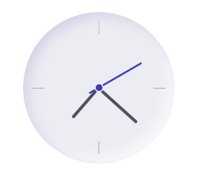
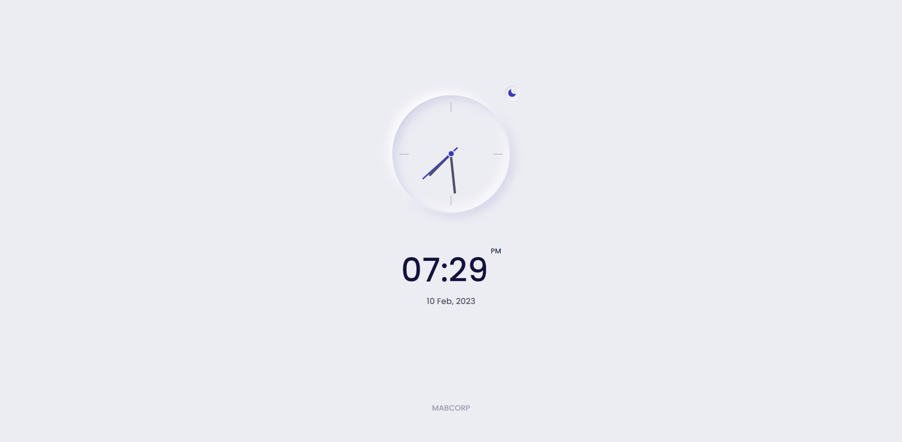

  

<h1 align="center">
  Analog Clock
</h1>

<h3 align="center">
  HTML CSS & JavaScript | Light & Dark Theme
</h3>

  

This repository contains an interactive analog clock built with HTML, CSS, and JavaScript. The clock provides an accurate representation of the current time, with animated hands that move dynamically based on the time. The clock face and hands have been styled with CSS to give it the traditional look of an analog clock. The clock is fully customizable, allowing users to change its appearance and functionality to meet their specific needs. This clock provides a visually appealing and interactive experience for users, making it a great addition to any website or application. 
An analog clock made with HTML, CSS, and JavaScript is a digital clock that imitates the appearance and functionality of a traditional analog clock. It consists of HTML elements to create the clock face, CSS for styling, and JavaScript for controlling the clock's movements and displaying the time accurately. The clock is animated using JavaScript, and the hands of the clock move dynamically based on the current time. The clock can be customized to change the appearance and functionality to meet specific needs. This type of clock provides a visually appealing and interactive experience for users.  

  
<!-- ................................................................................................................................. -->

### Features
 
Following are some of the new features and learning encountered while creating this amazing project:

- This site is theme supported and the user can maintain one for its use.

  
<!-- ................................................................................................................................. -->

### Resources
 
Follwing resources have been used in maintaining this project:

- [Box Icons](https://boxicons.com/) is used to import the icons into the project
- [Google Fonts](https://fonts.google.com/) is used to import the font family of `Poppins`
- [W3 Schools](https://www.w3schools.com/colors/colors_hsl.asp) to find the hSL value for the theme customization
- [Remove BG](https://www.remove.bg/upload) to remove the background of the image to make it a logo. 

  
<!-- ................................................................................................................................. -->

### Demo

  The Demo of this working project can be found on  
  <a href="https://rebrand.ly/AnalogClock_MABCORP">https://rebrand.ly/AnalogClock_MABCORP</a>

  
<!-- ................................................................................................................................. -->

### Video

You can exclusively watch the video on this project from the making to deploying on my     channel with the link given below 

  [Video Link](# )  

  If you like my video then do Like the Video and share it with others.

  
<!-- ................................................................................................................................. -->

### Graphical User Interface

  
<!-- ................................................................................................................................. -->

### Technology Stack
 
Follwing technologies have been used at the core of this application to make it stand in the market place:

- HTML
- CSS
- JavaScript

  
<!-- ................................................................................................................................. -->

### Advancement

> Nothing Recommended Yet

  
<!-- ................................................................................................................................. -->

### Deployment Details

The website is deployed using the free hosting provided by **Vercel**

  

  
Later on the link was customized using the well-known URL shortener and customizer **Rebrandly**:  

  

  
<!-- ................................................................................................................................. -->

### Developer

Muhammad Abdullah Butt  
abdullahbutt12292210@gmail.com  
> [Instagram](https://www.instagram.com/abdullah.butt.22/) 
> [FaceBook](https://www.facebook.com/profile.php?id=100076291614529) 
> [YouTube](https://www.youtube.com/channel/UCnuOFQyMywg-KuoN-lmav1Q) 
> [Portfolio](https://rebrand.ly/MuhammadAbdullahButt_MABCORP) 
> [Project Displayer]( https://rebrand.ly/ProjectDisplayer_MABCORP)
  
<!-- ................................................................................................................................. -->

